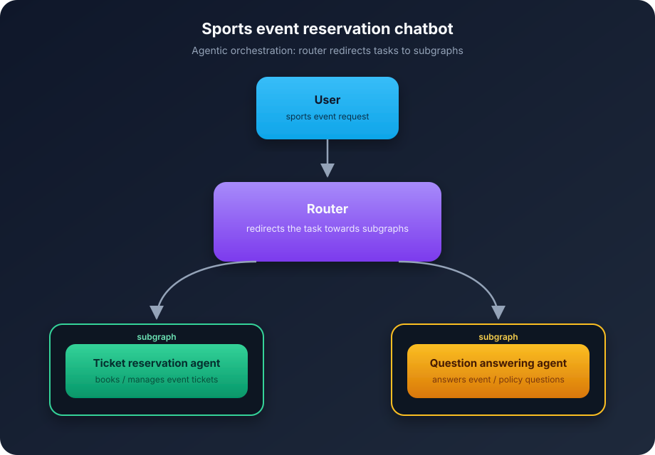

# evaluating-agents

A small demo of evaluating an agentic system: a sports event reservation chatbot built with LangGraph and local Ollama models.

## Orchestration



The graph has three nodes:

- a **router** that sends the request to the right subgraph
- a **ticket reservation** agent (book, buy, change, cancel)
- a **question answering** agent (schedule, price, venue, policies)

Prompts are in `prompts/`. Event and policy data is injected in the system prompt instead of RAG, just to keep the example self-contained.

## Evaluation strategies

Everything lives in `evaluation.ipynb`. Each eval uses a small gold dataset.

1. **Routing accuracy** — did the router pick `ticket_reservation` or `question_answering`?

2. **Trajectory optimization** — did the graph follow the expected node sequence (e.g. `router → question_answering`)? Scored with sequence similarity, since order matters in agent graphs.

3. **Question answering accuracy** — is the final answer correct? Scored with an LLM-as-judge (`prompts/accuracy_judge.j2`), not exact string match. Key points can be included or left out when judging.

The notebook compares Qwen 3.5 at 0.8B and 2B.

## Setup

Python 3.13+, [Ollama](https://ollama.com), and a pulled model:

```bash
ollama pull qwen3.5:0.8b
```

```bash
uv sync
jupyter notebook evaluation.ipynb
```
